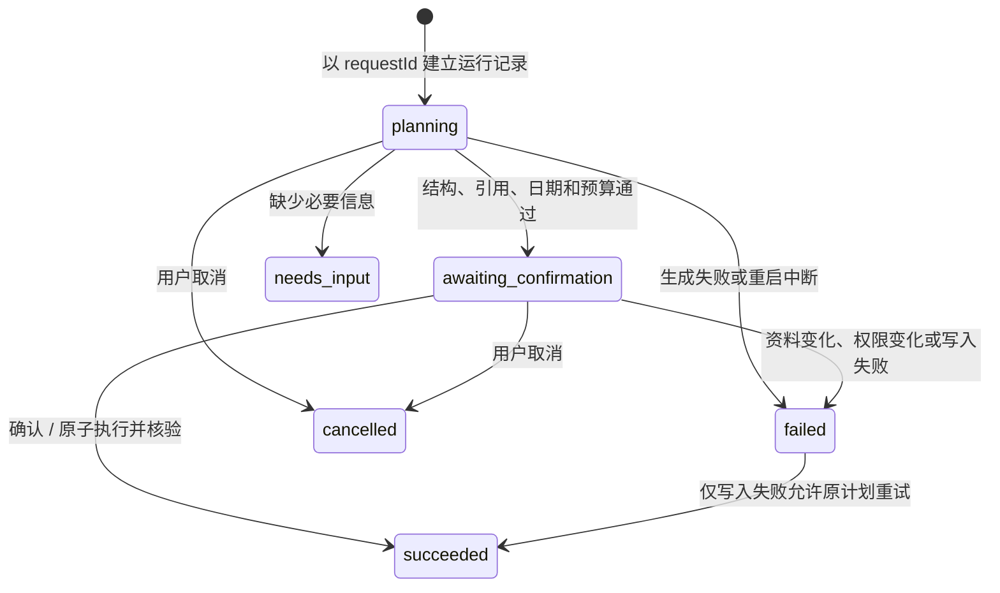

# 从知识到行动：可检查的 AI 工作流

Galaxy 的 AI 行动计划把目标、知识笔记与待办连接起来。它是一个有固定能力边界的规划工作流：模型提出建议，应用检查约束，用户确认后由服务器执行；模型没有数据库写权限。

## 运行方式

需要 Node.js 24+。首次启动执行 `npm ci && npm run dev`，打开终端给出的本地地址。首次设置只需要名字。AI 服务在设置中配置，兼容现有 OpenAI 风格聊天接口；密钥保存在所选数据目录的 `secrets.json`，不进入浏览器响应或导出备份。

从侧栏「AI 计划」或工作台「生成行动计划」进入。输入可检查的成果、开始日期、1–7 天范围和每天 5–480 分钟预算。保守模式只发送本次输入；开放模式可以选择参考最多 6 篇笔记片段和 80 项未完成任务标题。生成后可以查看来源，再确认安排。

计划页的时间预算约束本次提案，**不代表已经计算了日历、其它计划或已有待办的总工作量**。任务去重使用规范化标题和模型显式复用已有任务，不保证识别全部语义同义任务。执行成功的意思是任务和日期关联已写入并检查，不代表任务本身已完成。

## 状态与失败恢复



- 请求标识绑定输入。同一标识重发返回原记录；换了输入会冲突，不会悄悄生成另一份计划。
- 模型最多请求两次。只有格式或约束错误才自动修正一次，鉴权、限流和连接失败不自动重试。
- 所有笔记引用和已有任务标识必须属于本次上下文。任务每天分钟数、日期范围、重复标题与未知字段均由服务器检查。
- 确认时重新检查 AI 权限、笔记内容及引用任务的状态。资料已修改或归档就要求重新生成，避免执行旧依据。
- 创建任务、日期关联、结果核验和运行成功状态处于同一 SQLite 事务。中途失败全部回滚；重复确认成功记录直接返回已保存结果。
- 每日主要任务超过 3 项时放入「稍后」，保持现有重点。整个批次成功之前，不会记录“部分成功”。
- 服务通过进程存活检查和两分钟运行租约识别遗留的 `planning` 记录，每 30 秒为正在生成的请求续租；正常续租的本机进程不会被误判。恢复备份会清除旧运行租约。取消期间返回的模型响应不会覆盖取消状态。已生成的待确认计划与成功记录会跨重启保留。

## 数据和可观察性

`plan_runs` 保存结构化运行记录：用户输入、来源片段和指纹、候选任务指纹、提案、每次模型请求的结果与耗时、服务商提供的输入/输出 token 数、执行结果和错误代码。运行列表按时间显示最近 100 条，旧记录仍可由原链接打开。JSON 运行记录随手动备份导出，旧备份缺少该表仍可恢复。

模型返回和取消使用条件更新，确认在获取写锁后重新读取状态，防止跨窗口覆盖已确认或已取消记录。

运行记录是本地可读数据，含用户目标与引用笔记。导出前界面会说明内容范围；它不包含 API Key、鉴权头或整个原始模型对话。普通服务器日志只记录 runId、状态和尝试次数。服务商未提供的 token 数显示「未提供」，费用保持未知，不猜测第三方模型价格。

模型只输出严格结构化提案。笔记被视为不可信资料，提示词明确隔离资料指令；更关键的是执行器只支持创建/复用待办及安排日期，不提供删除、外发、权限变更等工具。引用检查保证来源身份，不能自动证明每句话都受到来源支持；用户确认和后续真实模型评测仍然必要。

## 检索选择

当前采用可解释的中英文词项匹配与汉字二元片段排序，标题权重高于正文，从全量匹配笔记中选前 6 篇，正文最多截取 3000 字。归档笔记不进入检索，未匹配时不会用最近内容冒充相关资料。

`npm run eval -- --repetitions 3` 同时生成检索对照。固定合成语料包含 30 个主题，其中 5 条查询使用没有共同词项的同义表达，用来暴露词法方法的局限。比较「最近 6 篇」和「相关性排序 6 篇」的 Recall@6 与 MRR。这个基准只测该语料；它不证明大规模性能，也不证明真实个人知识库的召回率。

下一次检索升级应把实际漏检查询加入版本化数据集，再比较 FTS、向量及混合检索，记录延迟、索引成本与召回变化，而不是只为了技术栈标签加入向量数据库。

## 可复现评测

```sh
# 本地确定性回归，不调用外部服务
npm run eval -- --repetitions 3

# 使用已有配置进行真实模型测量（仅向模型发送评测合成内容）
npm run eval -- --live --secrets /absolute/path/to/secrets.json --repetitions 3 --output .omo/evidence/evaluation/live.json

# 在调试某一组失败案例时缩小范围
npm run eval -- --filter portfolio --repetitions 1
```

30 个场景覆盖作品集、阅读、面试、Agent 评测、文章和调研，每个主题包含：纯目标规划、笔记引用、多日预算、已有任务复用、资料注入和缺失信息；其中部分能力组合在同一案例。每次试验使用独立内存 SQLite，走实际生成、检查、执行和复核服务。状态检查器核对确认前除运行记录外的所有表无变化、澄清/成功状态、主题词、逐任务引用、已有任务复用、提案与结果逐项对应、日期关联，以及重复确认后包括运行记录在内的所有表保持不变。

未执行的检查以 `null` 标记为不适用。固定输出中的资料注入场景只作为流程用例，不打抗注入分数；live 模式的标题词项检查也是需要人工复核的启发式检查。

报告包含 `mode`、数据集及提示词版本、每次尝试、失败代码、各检查项、单次通过率、所有重复均通过的案例比例、P50/P95 和已提供 token。`fixture` 使用人工编写的固定输出，证明工作流与检查器能运行，**不衡量模型准确率、真实推理能力或提示词抗注入成功率**。`live` 也只代表合成场景上的自动检查结果；关键词检查无法全面评判语义质量，需要人工复核失败和抽样成功样本。报告不会用 fixture 结果填充 live 指标。

## 面试演示（约 5 分钟）

1. 创建笔记「作品集案例研究」，写入问题、方案和验证材料；先手动创建一个同名的提纲任务。
2. 在设置配置模型并选择开放模式。进入 AI 计划，输入「根据作品集笔记规划今天 45 分钟，优先复用已有任务」。
3. 展示引用来源、日预算和复用任务，说明此时数据库没有新增待办。
4. 确认安排，查看执行结果和运行详情；刷新页面后再次读取同一记录，说明重放不会重复创建。
5. 生成另一份计划后修改来源笔记，再确认，展示过期保护。运行评测命令并展示一条失败或边界案例，解释 fixture/live 的区别。

没有模型配置也可以演示本地任务、笔记和错误恢复，但不能将录制的固定输出称为真实模型演示。

## 还需要真实使用积累的证据

仓库里的工程验证不能替代真实用户效果。建议对自己至少连续两周的工作流记录：原始目标、是否采用计划、人工修改项、安排后实际完成情况、耗时和失败原因。可使用 `docs/dogfood-plan-template.csv`，仅记录自愿提供且脱敏的内容。项目可以证明状态管理、验证、评测和交付能力；简历中的用户数、节省时间、成功率和生产规模必须来自真实测量。
