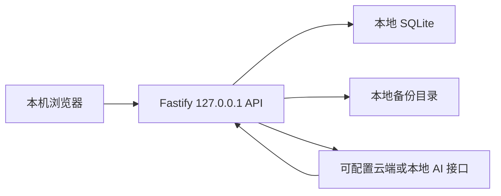

# 银河居所项目说明书

> 文档状态：第一版功能闭环已验收  
> 版本：0.1.0  
> 日期：2026-08-07  
> 临时应用名：银河居所（后续可更改）

## 1. 项目概述

银河居所是一款面向个人使用的本地优先个人空间应用。它帮助用户低成本捕捉碎片想法，将较大的目标逐步拆成可完成的小任务，并通过待办、习惯、周期项目、每日收获、每周回顾和 AI 助手形成持续行动闭环。

产品不追求传统效率工具的高压管理感。核心体验是温和、具体、无评判：一次只关注当前阶段和下一小步，让用户在持续完成中获得成就感。

应用品牌名与用户空间名相互独立。第一版临时品牌名为“银河居所”；首次引导允许用户自行命名个人空间，默认名称为“我的空间”。产品世界观为“一片星河中的每个个人空间都是一颗独特星星”。

## 2. 产品目标

1. 让碎片想法能够在几秒内被记录，避免因记录成本过高而遗忘。
2. 让 AI 协助用户澄清目标并渐进拆解项目，不一次展示令人畏惧的长任务列表。
3. 让用户每天只聚焦少量关键行动，并在未完成时获得温和复盘，而非内疚感。
4. 将待办、习惯、项目、回顾和 AI 陪伴整合为一个可持续使用的个人空间。
5. 保持数据本地可控；AI 不可用时，除 AI 能力外的所有核心功能仍可使用。

## 3. 设计原则

- **先捕捉，后整理**：随手记不要求立即分类。
- **渐进拆解**：项目只生成当前阶段需要的任务，不预先铺开完整任务树。
- **少量聚焦**：首页最多放置 3 个主要待办，其中 1 个为今日重点。
- **无评判反馈**：拖延、暂停、放弃和休息都不被塑造成失败。
- **用户掌控**：AI 提供建议，但高影响操作必须由用户确认。
- **本地优先**：业务数据保存于本机，备份和恢复由用户控制。
- **功能优先**：第一版先完成可运行的电脑端功能闭环，视觉风格后续迭代。

## 4. 目标用户与主要场景

第一版是单用户、无账号、本机运行的个人工具，首先服务项目创建者本人。

核心场景：

1. 突然想到一件事，通过文本或语音快速记入收集箱。
2. 稍后整理收集箱，自行选择分类、加入今日、关联项目、归档或删除。
3. 创建“学习某个技术框架”等周期项目，由 AI 询问少量澄清问题并生成当前阶段。
4. 每天完成少量待办和习惯，记录当天收获。
5. 每周查看 AI 汇总、阻碍分析和下周改进建议，并选择是否采纳。
6. 随时展开全局 AI 助手，讨论个人空间内容或普通生活问题。

## 5. 第一版范围

### 5.1 平台与交付

- 仅做电脑端响应式 Web 应用，不专门适配手机。
- 本机通过一个命令启动，在浏览器中使用。
- 无注册、登录、云同步和本地应用锁。
- 应用仅监听 `127.0.0.1`，不默认暴露到局域网。
- 核心功能验证稳定后，再考虑桌面安装包、手机端和 PWA。

### 5.2 主导航

左侧导航包含以下五项，并支持折叠：

1. 首页
2. 待办
3. 项目
4. 习惯
5. 回顾

设置入口位于左侧导航底部。右侧为独立 AI 助手入口，点击后展开会话侧栏并挤压主内容区宽度；关闭后主内容按比例恢复，侧栏宽度可拖拽调整。

导航结构应允许后续新增栏目，但第一版不展示空占位栏目。

## 6. 首页

首页是“今日空间”，包含以下固定区域：

### 6.1 每日短语

- 每天首次打开时随机选择一句，当天保持不变。
- 用户可手动切换下一句。
- 用户可新增、编辑、删除和停用短语。

### 6.2 今日待办

- 最多 3 个主要待办，其中可指定 1 个“今日重点”。
- 临时小事可放在次要区域，不占主要待办额度。
- 已完成任务折叠进“今日已完成”，不占用活跃区域。
- 昨日未完成任务不会永久自动顺延；次日提示用户重新安排、请 AI 缩小、移回收集箱或放弃。

### 6.3 今日习惯

- 只展示今天需要完成的习惯及当前状态。
- 区域顶部显示完成数量，如 `1/2` 或“全部已完成”。
- 详细连续记录、统计和日历只在习惯页展示。

### 6.4 周期项目

- 最多展示 3 个由用户置顶的进行中项目。
- 每个项目只显示名称、AI 估算进度和当前任务。

### 6.5 今日收获

- 一天内可多次追加，每条记录保存时间。
- 支持编辑和删除。
- 首页显示当天最近记录，完整内容进入回顾页。

### 6.6 随手记入口

- 首页可直接输入文本。
- 应用内任意页面都可通过固定快捷键唤起随手记。
- 保存后返回原页面，不要求立即分类。

## 7. 待办与收集箱

### 7.1 统一条目模型

不单独建立“想法”和“任务”两种视觉类型。随手记统一进入待办空间，用户后续可：

- 加入今日待办；
- 添加到一个或多个自定义分类；
- 关联周期项目；
- 归档；
- 删除；
- 转为新项目。

### 7.2 收集箱规则

- 既没有自定义分类、也没有项目关联的活跃条目进入收集箱。
- 已关联项目的条目即使没有自定义分类，也不进入收集箱。
- 收集箱默认按最新记录在前。
- AI 可在后台分析并给出建议，但保存随手记后不得立即打断用户。
- 分类通常由用户决定；AI 主要在整理时或每周回顾中建议去向。

### 7.3 自定义分类

- 第一版只做单层分类，不支持嵌套。
- 分类支持自定义名称、颜色、图标和排序。
- 一个待办可以同时属于多个分类。
- 同一待办在不同分类中编辑、完成或归档时，状态全局同步。
- “今日待办”是临时聚合视图，不是分类；加入今日后仍保留原分类。
- 项目关联与分类相互独立。

### 7.4 待办字段

必填：

- 标题。

可选：

- 备注；
- 截止时间；
- 基于截止时间的提醒；
- 一个或多个分类；
- 关联项目。

第一版明确不包含：

- 计划日期；
- 预计耗时；
- 高、中、低优先级；
- 重复待办；
- 多层子任务树。

截止时间只表示最晚完成时间，不会自动把任务加入今日待办。没有截止时间时不能设置任务提醒；提醒可设置在截止时或提前触发。

### 7.5 排序与状态

- 今日待办和自定义分类支持拖拽排序。
- 完成后保留完成时间，可在“已完成”视图查看和重新打开。
- 归档内容从活跃列表移除，保留在独立归档视图和全局搜索中。
- 归档不等同于完成，不进入完成统计。

## 8. 语音随手记

- 单次录音最长 2 分钟。
- 支持暂停、继续、取消和录音时长显示。
- 音频发送到可配置的语音转写服务。
- 转写文字必须先供用户确认和编辑，再保存为普通随手记。
- 保存或取消后立即删除原始音频，第一版不做音频归档。
- 默认复用 AI 服务配置；若聊天服务不支持转写，可单独配置兼容 `/v1/audio/transcriptions` 的服务。
- 转写服务不可用时明确显示错误，不丢失尚未提交的录音状态。

## 9. 周期项目

### 9.1 创建

必填：

- 项目名称；
- 最终希望达到的结果。

可选：

- 截止日期；
- 开始原因；
- 补充说明。

AI 在创建后通过少量、逐个出现的问题澄清成功标准与当前情况。

### 9.2 渐进拆解

- AI 只生成当前阶段、当前任务和下一任务，不提前展示完整项目任务链。
- 当前任务完成后，提供可跳过的简短反馈框，用户可填写实际成果和阻碍。
- AI 根据反馈调整下一任务；当前阶段完成后才生成下一阶段。
- AI 生成的当前任务不会自动加入今日待办，只提供推荐，用户确认后加入。

### 9.3 项目页

项目页优先展示：

- 最终目标；
- 当前阶段；
- 当前任务；
- 下一任务；
- AI 估算进度条；
- 最近进展；
- 已完成阶段时间线。

进度条必须标注为“AI 估算”。它根据阶段成果、执行反馈和目标变化更新，不以未知的总任务数制造虚假精度。

### 9.4 项目状态

- 进行中；
- 暂停；
- 已完成；
- 已归档。

暂停项目不触发提醒或 AI 催促。恢复时 AI 协助重新确认当前阶段。项目始终允许手动维护阶段、当前任务、下一任务和进度；AI 恢复后以人工现状为准，不覆盖手动修改。

## 10. 习惯

### 10.1 习惯类型

默认类型为“一次完成型”，当天使用勾选按钮完成。

可选类型为“次数目标型”：

- 创建时设置每日目标次数；
- 使用加号逐次记录，显示如 `3/8`；
- 达到目标后当天记为完成；
- 达标后仍可继续累计，如 `10/8`；
- 当天完成习惯数量仍只计 1 个；
- 支持撤销最近一次记录。

### 10.2 频率与休息

- 支持每日习惯；
- 支持每周目标频率；
- 支持固定休息日；
- 支持临时请假日。

每日习惯显示“已连续打卡 X 天”，休息日和请假日自动跳过，不中断连续记录。非每日习惯不显示连续天数，只显示累计“已打卡 X 次”。

### 10.3 习惯页

- 展示每个习惯的当前统计信息；
- 展示每日完成习惯条数的每周折线图；
- 展示每日完成习惯条数的每月折线图；
- 提供日历视图，可按日期查看记录；
- 历史记录允许补记、减少次数、改为未完成或标记请假；
- 后补和修改记录保留可见标识；
- 所有统计按修正后的记录重新计算。

## 11. 回顾

### 11.1 每日回顾

- 首页“今日收获”自动归入对应日期。
- 回顾页按日期汇总，可通过日历和搜索查看。
- 原始内容只能由用户修改；AI 不能直接改写原文。

### 11.2 每周回顾

- 一周定义为周一至周日。
- 周日晚上按用户设置时间生成；应用未运行时，下次启动后补生成。
- 数据来源包括完成待办、习惯趋势、项目推进、每日收获和用户反馈。
- 输出包含本周摘要、完成情况、可能的阻碍模式和下周具体改进建议。
- 每条建议可预览并转为待办、习惯或项目，保存前由用户确认。
- 不采纳的建议只保留在该周回顾中。

## 12. AI 助手

### 12.1 交互形态

- AI 是全局独立右侧栏，不嵌入任何业务页面。
- 在任意页面展开后保留当前页面上下文。
- 支持新建、重命名、搜索和删除会话。
- 首次引导设置 AI 昵称及 AI 对用户的称呼。
- 语气温柔但不敷衍，不批评、不制造内疚，不只给空泛鼓励。
- 用户受阻时，AI 先识别精力和阻碍，再缩小到当前可做的最小动作，也允许休息和重新规划。

### 12.2 长期记忆

- AI 只有在用户确认后才保存长期偏好、目标和重要背景。
- 设置中提供“AI 记忆”管理，可查看、修改和删除。
- 会话历史不自动等同于长期记忆。

### 12.3 权限模式

**保守模式**：

- 每次只读取当前问题所需的最少本地内容；
- 修改工作空间前需要用户确认。

**开放模式**：

- AI 可搜索和读取整个工作空间；
- 每次仍只向云端发送完成当前任务所需的内容，不把完整数据库塞入每个请求；
- 可自动执行可撤销的低风险操作；能力清单与实现状态如下：
  - 侧栏创建习惯、创建待办、创建项目骨架、更新/完成/归档待办、加入或移出今日、软删进回收站、设置分类、有限更新项目估算进度（已实现；保守模式需确认后执行）；
  - 同一轮回复可附带最多 12 个操作的数组，按序执行；可用 `as` / `$别名` 串联新建对象，`create_item` 可带 `todayMode`（已实现）；
  - 整理弹窗「请 AI 建议分类」、随手记捕获后后台分析预填（已实现；不自动保存）；
  - 开放模式且 AI 已配置时，周日调度可自动生成 AI 周报（已实现；失败则回退本地模板）；
  - 周回顾建议转换记入操作记录并可撤销（已实现）；
  - 项目拆解与反馈推进须在项目页确认后落库（已实现；AI 调整并完成先预览再确认）；侧栏 create_project 仅建骨架，同轮可用 create_item 另建待办并关联；
- 所有自动操作进入操作记录并支持一键撤销。

两种模式下，永久删除、批量修改、数据导出和改变核心目标等高影响操作始终需要确认。AI 永远无权执行永久删除。

权限模式可在 AI 侧栏附近和设置页切换。每次 AI 回答旁应能查看本次参考了哪些本地内容。

### 12.4 服务接入

- 第一版默认使用云端 AI API，用户自行配置服务。
- 采用兼容 OpenAI 请求格式的通用适配层，不绑定厂商。
- 设置项包括聊天服务地址、模型名称、API Key、转写服务地址和转写模型。
- 聊天优先支持兼容 `/v1/chat/completions` 的流式响应；转写支持 `/v1/audio/transcriptions`。
- API Key 只保存在本机秘密配置中，不在界面完整显示，不进入导出或备份。
- 未配置或服务不可用时，非 AI 功能全部正常运行；AI 区显示真实状态、配置入口和连接测试。
- 依赖 AI 的待处理内容标记为“等待分析”，恢复连接后可继续。
- 第一版不主动联网搜索最新新闻、天气、价格等信息；遇到时效性问题必须说明能力边界。

### 12.5 本地模型兼容

第一版不打包模型，但 AI 适配层允许以后把服务地址切换到 Ollama、LM Studio 或 `llama.cpp` 的本地兼容接口。是否正式支持本地模型，需要在 M1 8GB 设备上对中文项目拆解质量和内存占用进行独立验收。

## 13. 搜索、回收站与操作记录

### 13.1 全局搜索

- 搜索范围覆盖待办、分类、项目、习惯、回顾和 AI 会话。
- 支持内容类型和日期筛选。
- 搜索与随手记使用不同快捷键。

### 13.2 回收站

- 删除的业务内容先进入回收站。
- 默认保留 30 天，设置中可修改。
- 支持恢复和用户手动永久删除。
- AI 不得永久删除任何内容。

### 13.3 AI 操作记录

- 记录 AI 自动执行的可撤销操作、时间、原因和影响对象。
- 支持单次撤销。
- 高影响操作只记录用户确认后的结果。

## 14. 提醒

支持以下提醒，并允许分别设置时间、开关和延后：

- 早间确认今天最想推进的内容；
- 有截止时间的待办提醒；
- 晚间填写今日收获；
- 周日每周回顾。

第一版本地 Web 应用只保证运行期间的通知。浏览器或服务关闭后不承诺系统级后台通知；下次启动时补显示错过的提醒。真正的后台系统通知留到桌面应用阶段。

## 15. 首次引导与教学示例

首次启动依次完成：

1. 设置用户个人空间名称，默认“我的空间”；
2. 设置 AI 助手昵称；
3. 设置 AI 对用户的称呼；
4. 可选配置并测试 AI 服务。

时区默认 `Asia/Shanghai`（UTC+8），可在设置中修改。AI 权限模式不强迫在首次引导中选择，可在侧栏或设置中随时切换，默认保守模式。

系统自动创建可删除的教学示例待办、教学示例习惯和使用说明。示例数据带“教学示例”标记，不进入完成率、连续打卡、图表或 AI 周回顾；用户编辑或复制后才转为真实数据。

## 16. 设置

第一版设置页包含：

- 个人空间名称；
- AI 助手昵称和用户称呼；
- 时区；
- AI 权限模式；
- 聊天与转写服务配置、连接测试；
- AI 长期记忆管理；
- 早间、截止、晚间和周回顾提醒；
- 每日短语管理；
- 自定义分类管理；
- 快捷键说明；
- 自动备份保留天数；
- 回收站保留天数；
- 数据导出、恢复和备份状态。

## 17. 本地数据与备份

- 业务数据保存在本机 SQLite 数据库。
- 每天自动创建数据库快照；应用未运行时，在下次启动补做当日快照。
- 自动备份默认保留 30 天，可配置为 7 至 365 天。
- 超出期限时只清理最旧的自动备份。
- 设置页显示自动备份占用空间和最近一次成功时间。
- 手动导出包含待办、项目、习惯、回顾、AI 记忆、会话和设置，但不包含 API Key。
- 手动导出采用带模式版本号的 ZIP/JSON 格式，便于跨版本恢复。
- 手动导出的文件不受自动备份清理规则影响。
- 恢复前自动创建恢复点；恢复失败时保留原数据库。

## 18. 核心数据模型

第一版至少包含以下实体：

- `workspace_settings`：空间名称、时区和基础偏好；
- `quotes`、`daily_quote_selections`：短语库与每日选择；
- `items`：统一待办/随手记条目；
- `categories`、`item_categories`：单层分类及多对多关系；
- `today_items`：每日待办、顺序和重点标记；
- `projects`、`project_stages`、`project_tasks`、`project_feedback`：渐进项目结构；
- `habits`、`habit_schedules`、`habit_logs`、`habit_exceptions`：习惯、频率、日志、休息与请假；
- `daily_gains`、`weekly_reviews`：每日收获和每周回顾；
- `ai_conversations`、`ai_messages`、`ai_memories`：会话和经确认的长期记忆；
- `ai_action_log`：AI 自动操作及撤销信息；
- `reminders`、`notification_events`：提醒配置和触发记录；
- `trash_entries`：软删除状态与清理时间；
- `tutorial_state`：教学示例与首次引导状态。

所有时间以 UTC 存储，展示与日期边界按用户设置时区计算。业务主键使用 UUID。数据库迁移必须有顺序版本且不可在启动时静默丢弃数据。

## 19. 技术方案

### 19.1 推荐技术栈

- Node.js 24 LTS，ESM；
- TypeScript 严格模式，禁止 `any` 逃逸；
- React 19.2；
- Vite 8；
- React Router 7 Data Mode；
- Fastify 5 本地 API 服务；
- Node 内置 `node:sqlite` 与显式 SQL 迁移；
- Zod 作为 HTTP、AI 结构化输出和导入文件的运行时边界验证；
- TanStack Query 管理服务端状态；
- Lucide React 提供界面图标；
- Recharts 绘制习惯折线图；
- `dnd-kit` 提供待办与分类拖拽排序；
- Vitest、Testing Library 和 Playwright 负责测试与真实浏览器验收。

选择单一 Node/TypeScript 运行时，避免为了本地数据库或 AI 再引入 Python、Rust 等第二套开发环境。`node:sqlite` 可减少原生第三方数据库依赖，并提供官方备份 API。

### 19.2 结构

```text
银河居所/
├── docs/
│   └── 项目说明书.md
├── src/
│   ├── client/        # React 页面、组件与交互
│   ├── server/        # Fastify API、调度、AI 与备份
│   └── shared/        # 共享类型、Schema 和领域常量
├── db/
│   └── migrations/    # 顺序 SQL 迁移
├── tests/
│   ├── integration/
│   └── e2e/
├── data/              # 运行数据，Git 忽略
└── package.json
```

该项目显著超过 8 个实现文件，并包含客户端、服务端、数据库、AI 和备份等多个组件。实现应按下方阶段逐步交付，但第一版完成标准仍以全流程验收为准。

### 19.3 运行拓扑



开发环境由 Vite 提供页面热更新并代理 `/api` 到 Fastify。生产构建由 Fastify 同源提供静态页面与 API，避免跨域配置。

### 19.4 命令与端口

- `npm install`：安装依赖；
- `npm run dev`：启动前后端开发服务；
- `npm run build`：类型检查并构建客户端和服务端；
- `npm test`：运行单元与集成测试；
- `npm run test:e2e`：运行 Playwright 关键流程；
- `npm start`：启动生产构建；
- 开发访问地址：`http://127.0.0.1:5173`；
- 生产访问地址：`http://127.0.0.1:4173`。

端口被占用时启动应失败并给出清晰错误，不自动暴露到其他网络接口。

## 20. 实现阶段

### 阶段一：项目基础与本地数据

- 建立严格 TypeScript、React、Fastify、SQLite 和迁移机制；
- 完成应用壳层、左右侧栏、路由、设置、首次引导；
- 完成自动备份、手动导入导出、回收站基础能力。

### 阶段二：待办与首页闭环

- 完成随手记、收集箱、多分类、今日待办、完成/归档/删除；
- 完成首页每日短语、今日收获和项目/习惯摘要；
- 完成拖拽排序、全局搜索和教学示例。

### 阶段三：习惯与回顾

- 完成两类习惯、频率、休息/请假、补记与统计；
- 完成周/月折线图和日历；
- 完成每日收获与每周回顾数据结构。

### 阶段四：项目与 AI

- 完成渐进式项目模型和手动维护；
- 完成 AI 通用适配层、会话、长期记忆和权限模式；
- 完成项目拆解、AI 估算进度、周回顾建议、操作记录与撤销；
- 完成语音转写入口和失败降级。

### 阶段五：提醒与完整验收

- 完成运行期间提醒与错过提醒补显示；
- 补齐错误状态、空状态和可访问性；
- 执行完整构建、测试和桌面浏览器人工验收。

## 21. 验收标准

### 21.1 核心成功路径

1. 首次启动可命名空间、设置 AI 昵称与称呼，并看到不计入统计的教学示例。
2. 用户可从任意页面文本或语音创建随手记，条目正确进入收集箱。
3. 一个条目可加入多个分类和今日待办，所有视图状态同步。
4. 今日主要待办不能超过 3 个，且只有 1 个今日重点。
5. 未完成任务次日进入复盘，不自动永久顺延。
6. 用户可创建两种习惯；打卡、超额计数、撤销、请假、休息、补记和统计均正确。
7. 用户可创建项目；AI 只生成当前阶段、当前任务和下一任务，完成反馈后再继续。
8. AI 不可用时项目可手动推进，其他模块不受影响。
9. 周日可生成包含摘要、阻碍和改进建议的周回顾，建议可经确认转换为业务内容。
10. 保守/开放模式发送范围符合定义；§12.3 已标注「已实现」的自动操作均可追踪和撤销（含侧栏确认流与操作记录撤销）。
11. 删除内容可从回收站恢复，AI 无法永久删除。
12. 自动备份、手动导出和恢复均可在真实数据上完成，API Key 不进入文件。

### 21.2 错误与边界路径

- AI 未配置、鉴权失败、限流、超时和返回非法结构时，界面给出可恢复错误且不写入错误数据。
- 转写失败时不创建空条目，不静默保留音频。
- 数据导入格式错误或版本不兼容时不覆盖现有数据库。
- 跨时区、夏令时、周日到周一边界、请假日和休息日不破坏统计。
- 同一条目出现在多个分类时，完成、归档、恢复与删除保持一致。
- 浏览器刷新、服务重启后，AI 会话、排序、当天短语和未提交之外的数据保持稳定。
- 所有主要键盘操作具有可见焦点；图标按钮具有可访问名称和悬停说明。

### 21.3 质量门槛

- 改动文件无 TypeScript 和 LSP 诊断错误；
- `npm run build` 退出码为 0；
- `npm test` 全部通过；
- `npm run test:e2e` 覆盖上述核心路径并通过；
- 使用 Playwright 在主流桌面尺寸截图检查，导航、AI 侧栏、图表、弹窗和长文本无重叠；
- 通过真实浏览器完成至少一次“捕捉 -> 整理 -> 今日完成 -> 回顾”和“创建项目 -> AI 拆解 -> 完成反馈 -> 下一任务”的人工流程。

## 22. 明确不做

第一版不包含：

- 手机端专门适配；
- PWA 安装与离线缓存；
- 桌面安装包和后台系统通知；
- 多用户、账号、云同步与协作；
- 本地密码锁；
- 打包本地大模型；
- AI 主动联网搜索；
- 图片、文件附件和原始音频存储；
- 计划日期、预计耗时、传统优先级和重复待办；
- 多层分类和完整子任务树；
- 医疗、心理诊断或危机干预能力；
- 商业发布、应用商店上架和商标申请。

## 23. 风险与失败处理

- **AI 供应商差异**：兼容接口不保证工具调用完全一致。所有结构化结果必须在服务端验证，验证失败则只展示文本建议，不修改数据。
- **上下文与隐私**：开放模式是全局可读而非每次全量上传。服务端必须按当前任务检索相关内容，并显示引用范围。
- **外部 API 中断**：AI、转写和联网服务不得成为本地业务功能的启动依赖。
- **数据损坏**：数据库写入使用事务；迁移和恢复前创建快照；失败时回滚到原文件。
- **本地模型能力不足**：本地模型是后续可选提供方，不作为第一版完成条件。
- **浏览器关闭后无提醒**：第一版明确补显示错过提醒，不声称具备后台通知能力。
- **需求规模较大**：按实现阶段推进，每个阶段都保持数据库可迁移和应用可启动，避免最后一次性集成。

## 24. 已延后决策

- **正式品牌名**：当前使用“银河居所”，由用户在公开分发前决定是否更名；更名不得覆盖个人空间名称。
- **最终视觉风格**：第一版采用清晰、舒适、轻量的基础设计；用户在真实使用后决定可爱治愈风格的具体配色和素材。
- **桌面与移动方案**：核心 Web 版通过实际使用后，再由用户决定 Tauri/Electron、手机响应式和 PWA 的优先顺序。
- **本地模型推荐**：待第一版 AI 流程稳定后，由实现者在目标设备上实测并提交质量与资源报告。

## 25. 技术依据

- [Node.js 24 LTS 发布状态](https://nodejs.org/en/about/previous-releases)
- [Node.js `node:sqlite` 与备份 API](https://nodejs.org/download/release/latest-v24.x/docs/api/sqlite.html)
- [React 19.2](https://react.dev/blog/2025/10/01/react-19-2)
- [Vite 8](https://vite.dev/blog/announcing-vite8)
- [React Router 模式说明](https://reactrouter.com/start/modes)
- [Fastify 5 文档](https://fastify.dev/docs/latest/)

